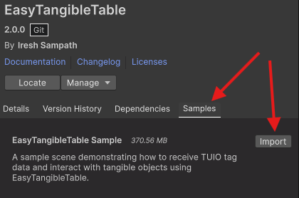
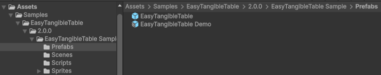
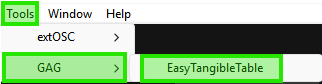
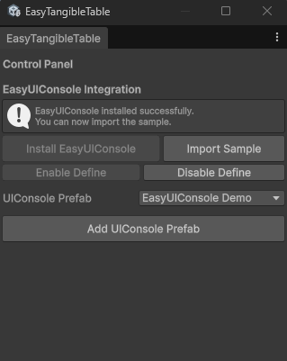

# 🧩 EasyTangibleTable for Unity


---

## 🚀 Overview

**EasyTangibleTable** is a lightweight Unity package for building **tangible table applications using the TUIO protocol.**

It allows Unity apps to **detect, track, and interact with fiducial markers (tags)** on interactive surfaces such as touch tables and projection systems.

The package provides:
- a clean event-driven API
- a component-based tag controller system
- an extensible architecture for interactive installations and R&D projects
  
### ⚙️ Features

- ✅ Detect tangible tags using TUIO protocol
- ✅ Track tag position, rotation, and movement
- ✅ Event-driven architecture
- ✅ Create custom tag behaviors
- ✅ Support for multiple tags simultaneously
- ✅ Built-in target alignment detection
- ✅ Clean EasyTT API
- ✅ Designed for interactive installations and R&D prototypes
  
Perfect for: 

**🧩 Tangible user interfaces**
**🎮 Interactive installations**
**🧪 R&D prototypes**
**🏛️ Museum installations**
**🎥 Multi-object interactive demos**

---

## 📦 Installation
EasyTangibleTable requires extOSC to receive TUIO messages.

Follow the installation steps in order.

### 1️⃣ Install extOSC (Required) via Unity Package Manager (Git URL)
1. Open **Unity → Window → Package Manager**
2. Click **+** → **Add package from Git URL**
3. Paste the following:
[https://github.com/IreshSampath/extOSC.git#upm](https://github.com/IreshSampath/extOSC.git#upm)
5. Click **Install**
   
### 2️⃣ Install EasyTangibleTable via Unity Package Manager (Git URL)

1. Open **Unity → Window → Package Manager**
2. Click **+** → **Add package from Git URL**
3. Paste the following:
[https://github.com/IreshSampath/unity-assets-easy-tangible-table.git](https://github.com/IreshSampath/unity-assets-easy-tangible-table.git)
5. Click **Install**

---

## 🧰 Import the Samples



After installing the package:
- 1️⃣ Open Package Manager
- 2️⃣ Select EasyTangibleTable
- 3️⃣ Go to the Samples tab
- 4️⃣ Click Import
  
---

## 🎮 Available Sample Prefabs



Inside the imported sample, you will find two prefabs.

### EasyTangibleTable
- Receiving TUIO tag and touch data
- Displaying tag details
- Debug logging

⚠️ EasyUIConsole is required for debug output.

### EasyTangibleTable Demo
This prefab demonstrates example tag behaviours and abobe bsic functaionalties.

Example tag controllers included:
```csharp
TagAController
TagBController
TagCController
TagDController
```

These show how to create custom tag interactions, such as:

- rotation-based UI states
- button interactions
- color selection
- alignment triggers

⚠️ EasyUIConsole is required for debug output.

---

## 3️⃣ Import EasyUIConsole

⚠️ This sample requires **EasyUIConsole** to display the logs.

Without **EasyUIConsole** the system still works, but debug messages will not appear.





---

## 🧠 Basic Usage

EasyTangibleTable provides a simple API via EasyTT.

Example
```csharp
using GAG.EasyTangibleTable;

void OnEnable()
{
    EasyTT.TagAligned += OnTagAligned;
    EasyTT.TagRemoved += OnTagRemoved;
}

void OnDisable()
{
    EasyTT.TagAligned -= OnTagAligned;
    EasyTT.TagRemoved -= OnTagRemoved;
}

void OnTagAligned(int tagID)
{
    Debug.Log($"Tag aligned: {tagID}");
}

void OnTagRemoved(int tagID)
{
    Debug.Log($"Tag removed: {tagID}");
}
```

#### 🎮 Create Custom Tag Behaviours

Each tangible tag can have its own controller script.

```csharp
EasyTangibleTagControllerBase
```

Example
```csharp
using GAG.EasyTangibleTable;
using UnityEngine;

public class MyCustomTagController : EasyTangibleTagControllerBase
{
    protected override void OnTargetReached()
    {
        Debug.Log("Tag reached target!");
    }

    protected override void OnTargetDeparted()
    {
        Debug.Log("Tag left target!");
    }
}
```
Attach this script to your tag prefab.

## 📡 Available Events

EasyTangibleTable exposes multiple events:

```csharp
EasyTT.TagPlaced
EasyTT.TagUpdated
EasyTT.TagMoved
EasyTT.TagRotated
EasyTT.ActiveTagsUpdated
EasyTT.TagAligned
EasyTT.TagAlignmentLost
EasyTT.TagRemoved
```

These events allow you to build complex interactions such as:
- UI triggers
- object manipulation
- multi-tag interactions
- experience control

---

## 🎨 Example Use Cases

EasyTangibleTable can be used for:

- tangible games
- interactive tables
- educational installations
- museum exhibits
- research experiments
  
---

## 📜 License
IT License — Free for commercial and personal use.

---

## 🙏 Thank You
Thanks for using EasyTangibleTable!
- Feel free to contribute
  
⭐ Star the repo
🐞 Report issues
🚀 Suggest improvements

---

## 👤 Author
Iresh Sampath 

🔗 [LinkedIn Profile](https://www.linkedin.com/in/ireshsampath/)
